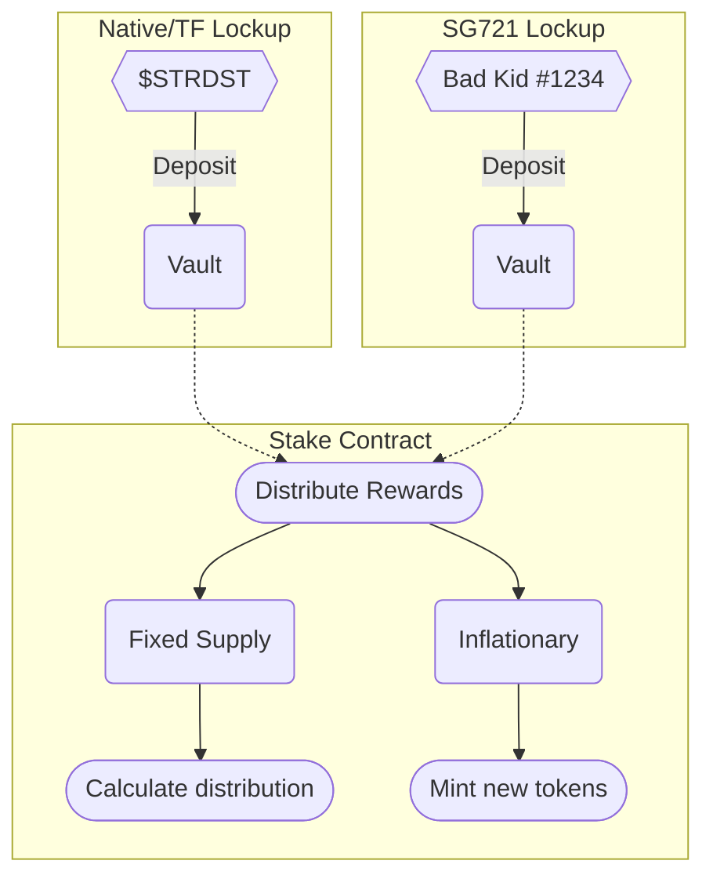

# OhhNFT On-Chain Stake Spec

**ohhnft-stake** is a Staragaze smart contract aimed at DAOs and NFT communities to allow for token ownership-based reward distribution with both fixed & inflationary models.



## Token Lockup

Both native/tokenfactory tokens and SG721 (NFT) tokens can be used with the staking contract. Depending on your needs, you can deploy either the **Native/TF Lockup** contract or the **SG721 Lockup** contract and link it to the Stake contract.

Both token lockup contracts use a 14-day lockup period by default. This can be modified by setting a custom value to the `lockup_interval` value within the instantiate message.

```json
{
  "lockup_interval": 0,
  "collections": ["stars1..."], // Used by SG721 Lockup
  "token": "ustars" // Used by Native/TF Lockup
}
```

## Reward Distribution

### Fixed Supply

Contracts using the fixed supply model hold tokens and distribute them over a set period of time. For example, if 100 tokens are to be distributed over 10 days in 1 day intervals, 10 tokens will be available to be claimed each day. If there are 5 tokens staked in the lockup contract, each of their owners will be able to claim 2 tokens per token staked.

<table>
  <tr>
    <th>User</th>
    <th>Global</th>
  </tr>
  <tr>
  <td>
    <table>
      <li>
        <b><i>n</i></b> - # of tokens locked
      </li>
      <li>
        <b><i>t<sub>x</sub></i></b> - time of last claim
      </li>
    </table>
  </td>
  <td>
    <table>
      <td>
        <li>
          <b><i>s</i></b> - total reward supply
        </li>
        <li>
          <b><i>i</i></b> - distribution interval
        </li>
        <li>
          <b><i>n<sub>t</sub></i></b> - total tokens locked
        </li>
      </td>
      <td>
      <li>
        <b><i>t</i></b> - current time
      </li>
      <li>
        <b><i>t<sub>a</i></b> - start time
      </li>
      <li>
        <b><i>t<sub>b</sub></i></b> - end time
      </li>
    </td>
    </table>
  </td>
  </tr>
</table>

$$R = n\cdot\left(\left(\frac{t-t_x}{i}-\frac{(t-t_x)\mod i}{i}\right)\cdot\left(s\div\frac{t_b-t_a}{i}\div n_t\right)\right)$$

### Inflationary Model

An inflationary model is not supported if your distributed rewards are in $STARS. This model requires the instantiator to be the admin of a tokenfactory token.

When using an inflationary model, the contract will mint a set amount of tokens per interval, splitting it evenly between tokens staked.
