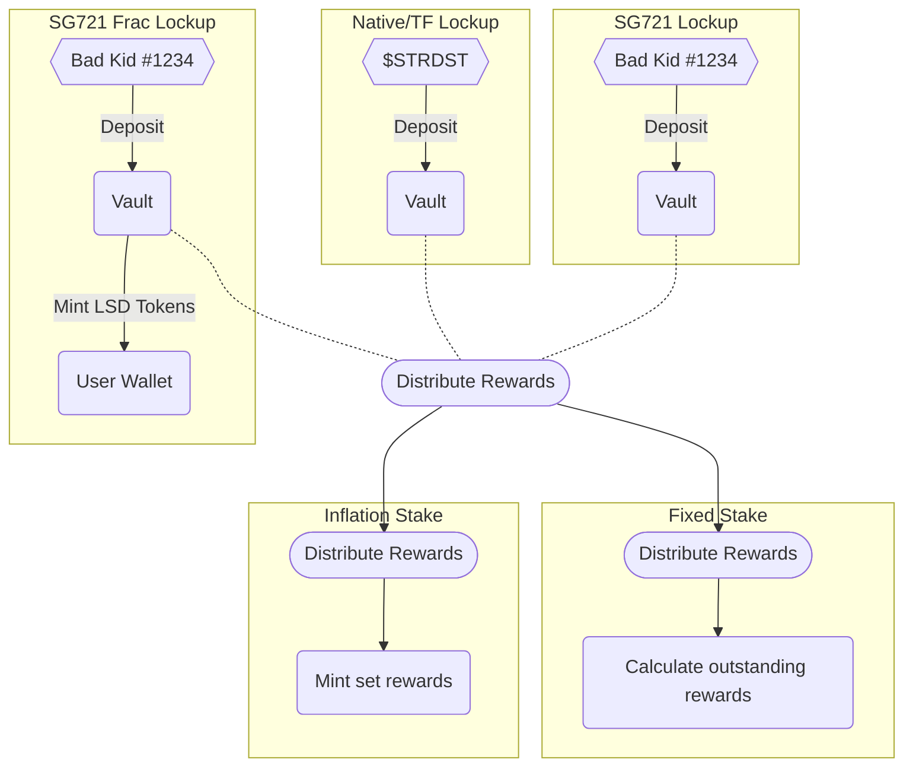

# OhhSTAKE Spec

**ohhstake** is a Stargaze smart contract aimed at DAOs and NFT communities to allow for token ownership-based reward distribution with both fixed & inflationary models.

## Usecase

**OhhStake** allows NFT communities to engage their users by rewarding them for holding their NFTs or tokens. The contract allows you to:

- Mint new tokenfactory tokens periodically as a proof-of-loyalty or NFT liquid staking token
- Distribute incentives in native tokens such as $STARS to your holders
- Query staked NFTs per user as a metric of voting power for your NFT DAO
- Allow your users to obtain a second set of rewards through providing liquidity for NFT LSTs

## Reward Distribution

### Fixed Supply

Contracts using the fixed supply model hold tokens and distribute them over a set period of time.

<table>
  <tr>
    <th>User</th>
    <th>Global</th>
  </tr>
  <tr>
  <td>
    <table>
      <li>
        <b><i>tx</i></b> - time of last claim
      </li>
    </table>
  </td>
  <td>
    <table>
      <td>
        <li>
          <b><i>s</i></b> - total reward supply
        </li>
        <li>
          <b><i>i</i></b> - distribution interval
        </li>
        <li>
          <b><i>nt</i></b> - total tokens locked
        </li>
      </td>
      <td>
      <li>
        <b><i>t</i></b> - current time
      </li>
      <li>
        <b><i>ta</i></b> - start time
      </li>
      <li>
        <b><i>tb</i></b> - end time
      </li>
    </td>
    </table>
  </td>
  </tr>
</table>

$$R = \left(\frac{t-t_x}{i}-\frac{(t-t_x)\mod i}{i}\right)\cdot\left(s\div\frac{t_b-t_a}{i}\div n_t\right)$$

### Inflationary Model

When using an inflationary model, the contract will mint a set amount of tokens per interval, splitting it evenly between tokens staked.

<table>
  <tr>
    <th>User</th>
    <th>Global</th>
  </tr>
  <tr>
  <td>
    <table>
      <li>
        <b><i>tx</i></b> - time of last claim
      </li>
    </table>
  </td>
  <td>
    <table>
      <td>
        <li>
          <b><i>s</i></b> - reward per interval
        </li>
        <li>
          <b><i>i</i></b> - distribution interval
        </li>
        <li>
          <b><i>nt</i></b> - total tokens locked
        </li>
      </td>
      <td>
      <li>
        <b><i>t</i></b> - current time
      </li>
      <li>
        <b><i>ta</i></b> - start time
      </li>
    </td>
    </table>
  </td>
  </tr>
</table>

$$R = \frac{s}{n_t}\cdot\left(\frac{t-t_x}{i}-\frac{(t-t_x)\mod i}{i}\right)$$
